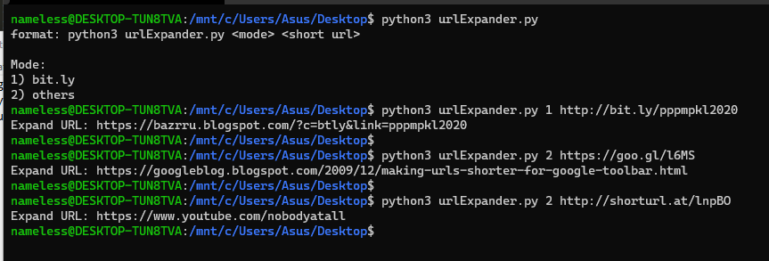

 # Short URL Expander
 
 Reveal the shorten link by expanding the shorten URL. 
 
 Useful to prevent clicking on shorten malicious links.
 
 Install Dependencies
 ```
 pip3 install -r requirements.txt
 ```
 
 Help Menu:
 ```
format: python3 urlExpander.py <mode> <short url>

Mode:
1) bit.ly
2) others
```
 
 Usage:
 
